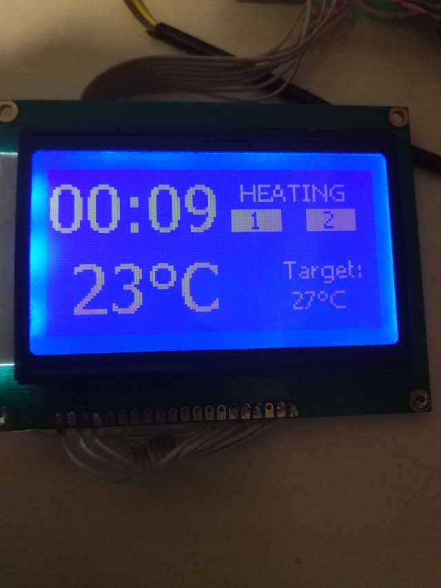

# esphome heater

Custom display component for J12864 Chinese character dot matrix LCD display module on ST7920
SPI interface.
Used:
1 GND - Power GND
2 VCC - Power VCC +5v
4 R/S(CS) H/L Data selection signal when parallel or chip selection when serial
5 R/W(SID) H/L read or right selection when parallel or data when serial
6 E(CLK) H/L enable when parallel or sync clock when serial 
17 RST H/L Reset, enable at low TTL
19 LED-A (LED-5V) Backlight postive +3.3 V
20 LED-K (LED-0V) Backlight negative GND
